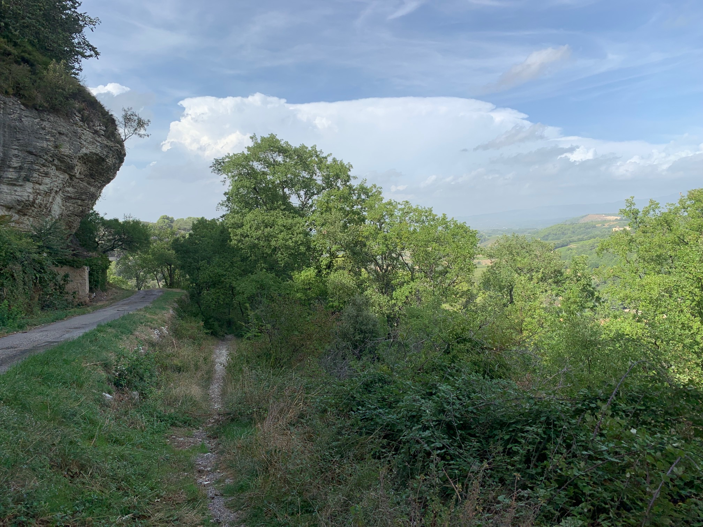
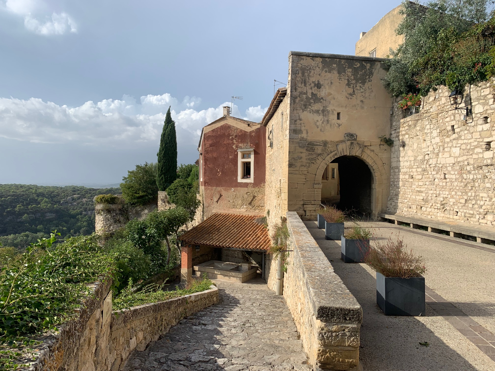

On Mondays, Tahoe had the cleaning lady's company in the afternoon, so I could make longer cycling trips. 
This day I went to Venasque, the old capital of the Comtat. I had seen on Google that the road was mostly flat, but steeper at 
the end.

First I cycled to Saint Didier. It is a nice little village together with a castle. Unfortunately, the castle had closed for
the season, so I continued to Venasque. The landscape became quite hilly. When I got close I saw that the town was quite high
above me. I parked my bike, and I took a footpath instead. That brought me here:

The town itself is reasonably level, it is on a kind of plateau.

 
