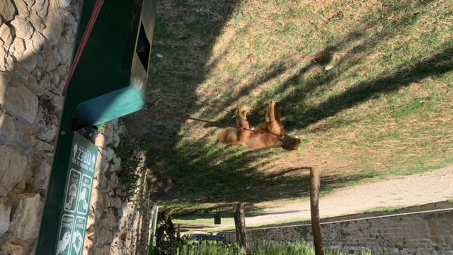
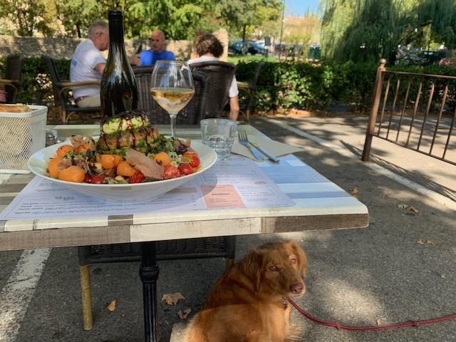
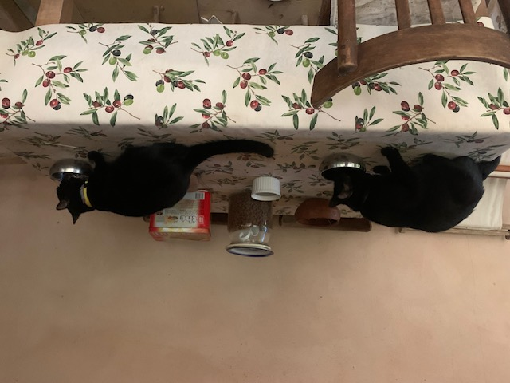
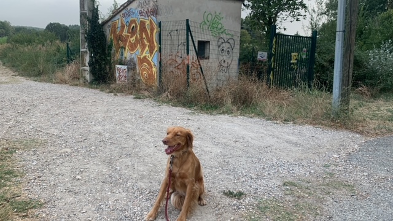
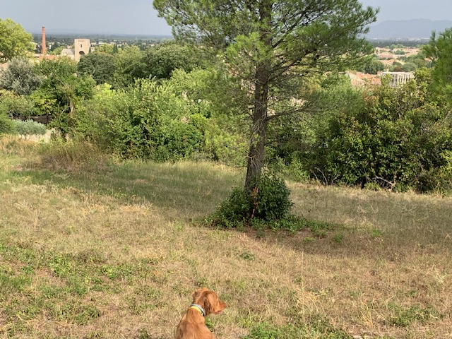

### Monday September 11

This did not start off well. I had been invited to stay a few days before the owners would leave, which was nice of course.
They did not need to worry about me getting there in time, and it gave me the opportunity to explore without the 
pet-sitting duties. So I arrived at the end of the afternoon. We had coffee in the garden, but I crashed through the chair that 
I was offered! At least I did not hurt my back or something like that. After that, I used the simpler type of chairs, with 
straight legs.

Later we had a nice dinner, that Vincent had cooked. On Tuesday he showed me around in the medieval town (the home is just 
outside the old city walls, almost right across from the river Nesque). He had an amazing career: born in a rural Brittany, 
leaving school at 15, he became an artist and later had a career at the French Ministry of Culture, where he was in charge
of lighting of the historical monuments of France. He gave me a signed copy of his book: _Les Lumières de la ville_.

On Wednesday, I cycled to L'Isle sur la Sorgue. I had been there in 1987, also by bicycle, and it was still just as beautiful.
I had lunch by the river, a niçoise sallad, looked around a bit, and cycled back. There was a nice path along the Canal de
Carpentras. This irrigation canal must follow countour lines, with hills on one side and lower-lying fields on the other side,
lusciously green because there is always water. 

On Thursday, Carine would come at 10 am to give instructions for the care of the animals, the home and especially of the garden.
The weather was still very warm. I was very lucky that their cleaning help would use her time on Mondays to take care a watering
plants and that there was at least one night with lots of rain.

### Friday

On Friday morning, Carine and Vincent left for the airport. I was to send daily photos of the pets, so there are many images.

||

It was a pleasure to take the dog to restaurants. In this kind of settings, Tahoe was on his best behaviour. Unlike Milo in Geneva,
he could completely ignore all provocations by a yapping poodle that its owner family let run around. He stayed just quietly and
peacefully under the table. This is where he was exemplarily well-trained. Pet setting this way was perfect, for example
having coffee in the mornings with a croissant at Café de la Place, reading the _Le Monde_ newspaper that was delivered at the home.

### Saturday, Sunday

Saturday is market day in Pernes. It was very close buy, the perfect spot to buy some local food. Or _Pad Thaï_! I explored more 
walks. The standard walk was in the river bed of the Nesque next to the city walls, but I could also take Tahoe in other directions,
towards the irrigation canal or into town.

||

### Monday 

In the morning I took Tahoe up the hills. I really wanted to try to find more walks where there was no danger from car traffic.

Monday afternoons were my time off. Tahoe had then company of Nathalie, the cleaning lady. During my sit, she worked mostly in 
the garden, watering the plants. I went off to [Venasque], the old capital of the Comtat.
