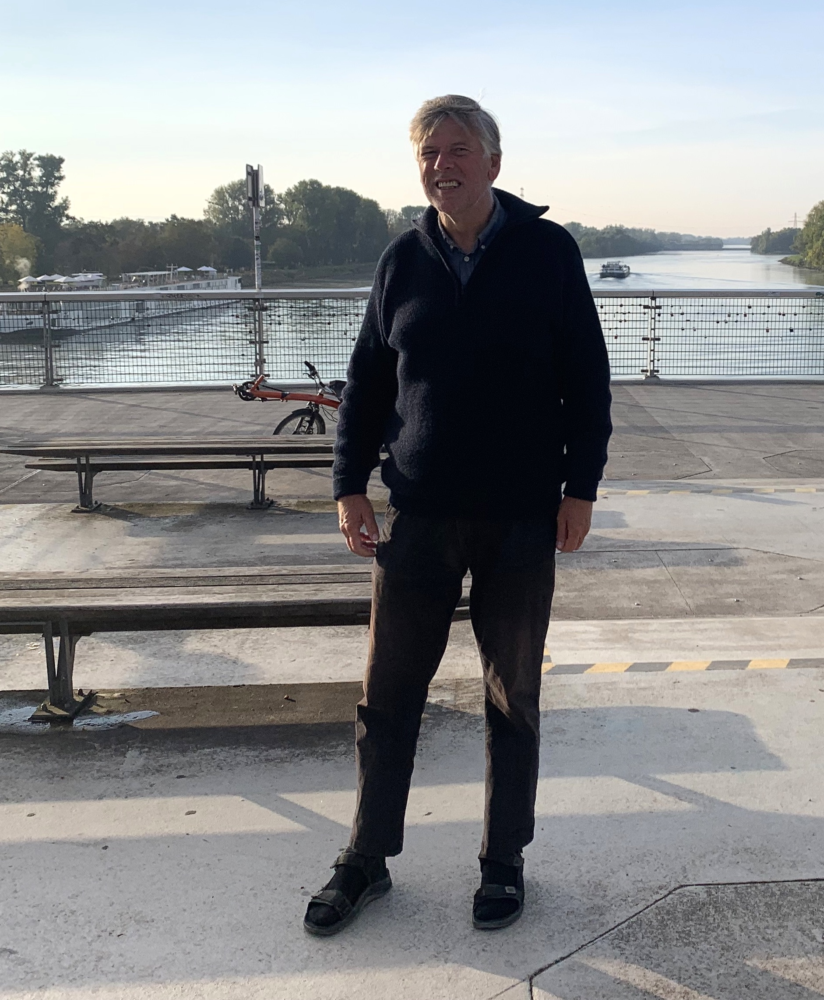

### Tuesday: crossing the Rhine at Strasbourg by bicycle 

Next to a pedestrian bridge that was a bit steep, there is now a nice new bicycle bridge.
In the middle, I took picture. There were also school groups, a French and a German class.
The teachers asked me to make a photo of them. 

And then I asked them to take a photo of me.
 

In the railway station of Kehl, I bought tickets for the direct train from Offenburg to 
Hamburg. And a reservation for a spot for my bicycle, all the way! But in Offenburg
it was a bit difficult to find the right carriage for that bicycle spot, that was not 
indicated on my ticket. I am afraid that I caused a bit of a delay, the conductor was
not happy.

Anyway, a few stations later we were on schedule. But the train arrived 55 minutes late 
in Hamburg. I decided to continue to Lübeck. Halfway, that train had a computer problem
and they needed to switch off the system. We sat in the dark for a while. After ten 
minutes it worked again.

I had not really paid attention in the Booking app and it was the same hotel as three 
months earlier, the one without a receptionist. But this time I managed to get my key card 
right away.

### Wednesday: cycling to Grömitz

There is no train anymore to Puttgarden. There is an express bus, but I doubted that my
recumbent would fit in these hooks on the backside. The weather was very nice, so I 
decided to cycle. First over the same cycling path that I had come three months earlier.
Again past the IKEA, and this time I noticed that it has its own railway stop with that 
name!

From Travemünde, I continued on the Ostseeküstenradweg to the north. I guess that schools
has autumn break: lots of school children with grandparents out walking and cycling.

Near Brodten, part of the cycle path had been eaten by erosion.

I got as far as Grömitz, where I stayed at the Strandhotel. Dinner at a Chinese restaurant. 

### Thursday: through flooding to the Fehmarn ferry

Next morning, the nice weather had gone. It was awfully windy: at breakfast I saw the kite 
surfers having great fun. 

There was rain on the radar but nothing hit the ground, so I
started cycling. Also Google suggested that I follow the Ostseeküstenradweg. But when I
got to this camping Seekamp, there was no asfalt. First gravel, then grass, then water! 

It was the storm Babet, that also caused trouble in the UK. The easterly winds caused
flooding in Denmark. But going back would have meant a detour, back up a hill. 
I thought that I could go through the fields. 

However, near the end, when I almost was at the yacht club, there was a ditch or a 
little stream. If there was a bridge at the path, I could not see it, it was completely 
flooded. 

 